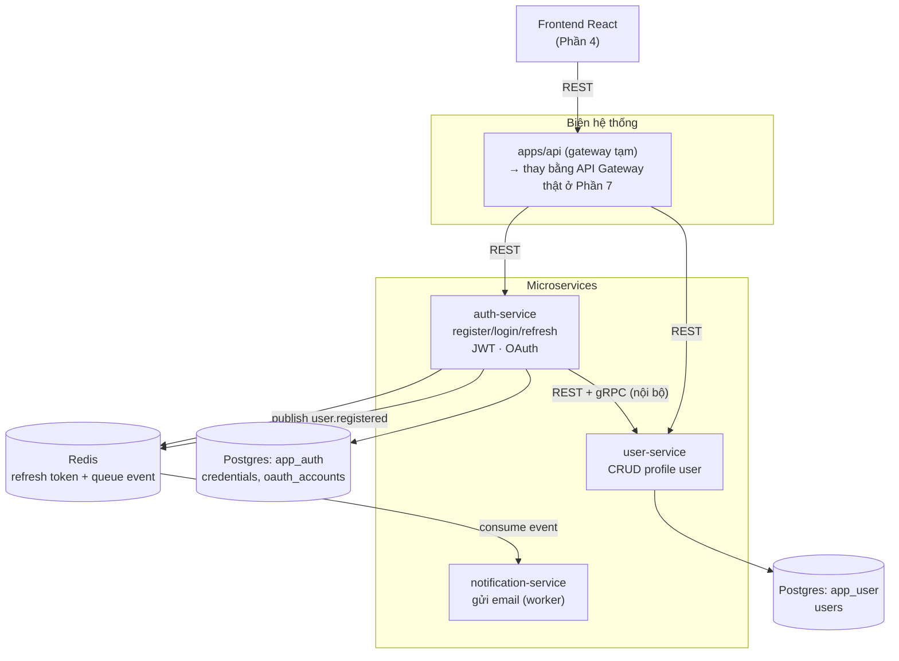

# Phần 6.1 — Khi nào (KHÔNG) nên Microservice & Kiến trúc đích

> Đây là commit **đọc trước khi code**. Nó chốt *vì sao* ta tách, *tách thành gì*, và
> — quan trọng không kém — *khi nào thì đừng tách*. Các commit 6.2 → 6.7 sẽ hiện thực hoá
> đúng sơ đồ ở cuối file này.

---

## 6.1.1 — Sự thật phũ phàng: microservice KHÔNG miễn phí

Ở Phần 0-5 ta có một **monolith** (`apps/api`): một process, một database, deploy một phát.
Nó chạy tốt, dễ debug, một transaction DB là xong. **80% dự án nên dừng ở đây.**

Microservice đổi **độ phức tạp trong code** lấy **độ phức tạp trong vận hành**:

| Monolith | Microservices |
| --- | --- |
| Gọi hàm (nanosecond, không bao giờ "fail") | Gọi mạng (millisecond, **có thể timeout/mất gói**) |
| 1 transaction DB đảm bảo nhất quán | Nhiều DB → **eventual consistency**, phải viết saga |
| Stack trace 1 mạch | Log rải rác nhiều service → cần **distributed tracing** |
| Deploy 1 lần | Nhiều pipeline, nhiều version, hợp đồng API phải tương thích |
| Refactor đổi tên hàm: IDE làm hết | Đổi field → phải phối hợp nhiều team/service |

> **Định luật cần nhớ:** "Nếu bạn chưa vận hành nổi một monolith cho ngăn nắp, microservice
> sẽ **nhân** sự lộn xộn đó lên, không chia nó ra." Đó là lý do tutorial này bắt đầu bằng monolith.

## 6.1.2 — Vậy KHI NÀO nên tách?

Tách khi có **áp lực thật**, không phải vì "nghe ngầu":

1. **Scale lệch nhau**: phần gửi mail/ xử lý ảnh ngốn CPU gấp 10 lần phần đăng nhập → muốn scale
   riêng phần nặng thay vì nhân bản cả monolith.
2. **Ranh giới team rõ ràng**: nhiều team muốn deploy độc lập, không chờ nhau.
3. **Ranh giới domain đã ổn định**: bạn *biết chắc* "auth" và "user profile" là hai thứ khác nhau
   và ít khi phải sửa xuyên cả hai cùng lúc. (Nếu còn hay sửa chéo → **đừng tách**, đường ranh chưa đúng.)
4. **Yêu cầu công nghệ khác nhau**: một phần cần Python (ML), phần khác Node.

> Trong tutorial này ta tách **vì mục tiêu học** — để bạn gặp *tận tay* các vấn đề (gọi mạng lỗi,
> saga, tracing) và cách xử lý. Ở dự án thật, hãy đối chiếu 4 tiêu chí trên trước.

## 6.1.3 — Nguyên tắc "tách theo domain, không theo tầng"

Sai lầm kinh điển: tách thành `controller-service`, `database-service`... (tách theo **tầng kỹ thuật**).
Đúng: tách theo **năng lực nghiệp vụ (business capability)** — mỗi service tự chứa đủ
routes → service → repository → DB của **một domain**.

Ranh giới ta chọn:

- **Ai là user?** → `user-service` (profile: id, email, name)
- **Làm sao chứng minh bạn là user đó?** → `auth-service` (mật khẩu, `role`, OAuth, cấp JWT, refresh token)
  — *`role` để ở auth-service, không phải user-service: xem lý do "login phải tự chủ" ở 6.2.*
- **Báo cho user biết điều gì đó** → `notification-service` (email chào mừng…)

Mỗi service **sở hữu dữ liệu của mình** và không ai được thò tay vào DB của người khác
(**database-per-service**). Muốn dữ liệu của service khác → **gọi qua API**, không JOIN thẳng DB.

## 6.1.4 — Kiến trúc đích của Phần 6

Những đường quan trọng để ý:

- **`auth-service` → `user-service`**: đây là **gọi liên service**. Lúc `register` tạo profile,
  lúc `login` lấy `role`/`name` để nhét vào JWT. Baseline dùng **REST**; ta sẽ **demo gRPC** cho
  chính luồng này ở 6.3 để so sánh.
- **`user.registered` qua Redis**: giao tiếp **bất đồng bộ theo event** — auth-service không chờ
  email gửi xong, chỉ *phát sự kiện*; notification-service tự tiêu thụ. (Nối tiếp Phần 5.)
- **Hai database tách biệt** `app_auth` và `app_user`: cùng một Postgres container cho nhẹ máy,
  nhưng **logic là database-per-service** — không service nào truy vấn bảng của service kia.

## 6.1.5 — `correlation-id`: sợi chỉ xuyên suốt

Ở Phần 1 mỗi request đã có `x-request-id`. Khi request đi qua **nhiều** service, ta **truyền tiếp**
id đó (gateway → auth → user). Nhờ vậy toàn bộ log của **một** hành động user — dù nằm ở 3 service —
đều mang **cùng một id**, gộp lại là dựng được toàn cảnh. Đây là nền cho distributed tracing (6.6).

## 6.1.6 — Lộ trình các commit tiếp theo

| Commit | Nội dung |
| --- | --- |
| **6.2** | Tách `apps/auth-service`, `apps/user-service`, `apps/notification-service` + `packages/shared`; chuyển code từ monolith |
| **6.3** | Giao tiếp: REST client + truyền correlation-id; **demo gRPC** auth→user |
| **6.4** | Database-per-service + **saga** đăng ký (tạo credential → tạo profile, bù trừ khi lỗi) + eventual consistency |
| **6.5** | Service discovery & cấu hình tập trung |
| **6.6** | Distributed tracing (OpenTelemetry + Jaeger) |
| **6.7** | Resilience: circuit breaker, timeout, retry |

> **Tự kiểm tra trước khi sang 6.2:** bạn có giải thích được vì sao `auth-service` *không được*
> `SELECT` thẳng bảng `users` của `user-service` không? Nếu có → bạn đã nắm tinh thần
> database-per-service, sẵn sàng tách code.
