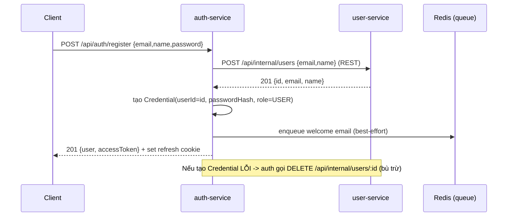

# Phần 6.2 — Tách service theo domain + `packages/shared`

> Đây là commit **dịch chuyển code thật**: monolith `apps/api` biến thành 3 service +
> 1 package dùng chung. Đọc kèm diff của commit này để thấy *cái gì đi đâu*.

---

## 6.2.1 — Bản đồ "cái gì đi đâu"

| Monolith (Phần 5) | Giờ nằm ở đâu |
| --- | --- |
| `modules/user/*` + bảng `users` | **user-service** (`app_user`) |
| `modules/auth/*` (register/login/refresh) | **auth-service** (`app_auth`, bảng `credentials`) |
| `queues/email/*` + `worker.ts` | **notification-service** |
| `utils/errors`, `middleware/*`, `lib/logger`, contracts Zod | **packages/shared** (`@app/shared`) |
| `apps/api` (toàn bộ monolith) | **apps/api** nay chỉ là **gateway-lite** (proxy) |

Field `role` **chuyển vào auth-service** (không ở user-service như phác thảo 6.1). Lý do:
đăng nhập cần `role` để nhét vào JWT — nếu `role` ở user-service thì mỗi lần login phải gọi
mạng sang đó, user-service sập là *không ai đăng nhập được*. Authz phải **tự chủ** ở nơi cấp token.

## 6.2.2 — `packages/shared`: lợi ích monorepo lộ rõ

`@app/shared` chứa thứ **mọi service đều cần** để không copy-paste:

- `errors.ts` — `AppError` + factory, để **mọi service trả lỗi cùng một hình dạng**.
- `http.ts` — `requestId` (correlation-id), `createErrorHandler`, `notFoundHandler`.
- `auth.ts` — `createAuthenticate(secret)` + `authorize(...roles)`: service nào có secret cũng
  **tự verify JWT** được (user-service verify để chặn route ADMIN). *Verify tập trung tại gateway
  là chuyện Phần 7.*
- `contracts/*` — Zod schema + type cho `user`, `auth`, và **event** (`WelcomeEmailJob`).
  Producer (auth) và consumer (notification) **cùng import** một kiểu job → không bao giờ lệch.

> Mẹo quan trọng: `@app/shared` **không** phụ thuộc `@prisma/client`. `errorHandler` nhận diện lỗi
> Prisma bằng *duck-typing* (`err.code === "P2002"`) thay vì import Prisma. Nhờ vậy package shared
> không bị kéo theo DB của bất kỳ service nào — giữ nó thật sự "chung".

## 6.2.3 — Luồng ĐĂNG KÝ: lần đầu ta gọi liên service



Ba điều mới so với monolith:

1. **Gọi mạng thật** (`auth → user`). Ở monolith đây chỉ là gọi hàm; giờ là HTTP, *có thể lỗi*.
   Xem `apps/auth-service/src/lib/user-client.ts` — bản **ngây thơ** (chưa correlation-id, chưa
   retry). 6.3 và 6.7 sẽ làm nó tử tế.
2. **Bù trừ (compensation) sơ khai**: nếu tạo credential lỗi sau khi đã tạo profile → xoá profile
   để không "mồ côi". Đây là mầm mống của **saga** (6.4).
3. **Sự nhất quán không còn tức thời**: hai bản ghi ở hai DB khác nhau → **eventual consistency**.

## 6.2.4 — Luồng ĐĂNG NHẬP: cố ý tự chủ

`login` **không bắt buộc** gọi user-service: `role` + `passwordHash` đều nằm trong `credentials`,
đủ để verify và cấp JWT. Nó chỉ gọi user-service để lấy `name` cho đẹp — và gọi kiểu **best-effort**:
user-service chập chờn thì `name` fallback về phần trước `@` của email, **đăng nhập vẫn thành công**.
Đây là tư duy *degrade gracefully*: chức năng lõi không gục theo một service phụ.

## 6.2.5 — gateway-lite: vì sao FE không phải đổi gì

`apps/api` giờ chỉ `http-proxy-middleware`:

```
/api/auth/*  → auth-service :4001
/api/users/* → user-service :4002
```

FE (Phần 4) vẫn gọi `:4000` như cũ → **không sửa một dòng frontend**. Gateway **không** verify JWT
(mỗi service tự lo) và **không** parse body (để nguyên cho service đích). Endpoint `/api/internal/*`
của user-service **không** được proxy ra ngoài — nó chỉ dành cho gọi giữa service.

> Đây mới là gateway "cho có". API Gateway thật (routing, verify JWT tập trung, rate limit,
> aggregation, BFF) là **Phần 7** — sẽ thay `apps/api` này.

## 6.2.6 — Database-per-service, một Postgres

Một container Postgres, hai database `app_auth` + `app_user` (tạo bằng `docker/postgres-init`).
Mỗi service có `schema.prisma` + migration + `DATABASE_URL` **riêng**. Quy tắc vàng: **không** service
nào `SELECT` bảng của service khác — muốn dữ liệu thì **gọi API**. Seed dùng `userId` cố định
(`SEED_ADMIN_ID`/`SEED_USER_ID` trong `@app/shared`) để credential ↔ profile khớp id → đăng nhập được.

## 6.2.7 — Config-per-service

Mỗi service tự đọc `.env` của mình (`dotenv`) → xem `apps/*/.env.example`. Đúng là hơi rải rác;
đó chính là vấn đề **6.5 (cấu hình tập trung)** sẽ giải quyết.

## 6.2.8 — Còn thiếu gì (sẽ làm ở các commit sau)

- **OAuth** chưa được port sang auth-service → **6.2b** (đăng nhập email/mật khẩu đã chạy).
- `user-client` còn ngây thơ (không correlation-id/retry) → **6.3** (+ demo gRPC), **6.7** (resilience).
- Bù trừ mới ở mức "xoá cho đỡ mồ côi" → **6.4** (saga bài bản).

> **Tự kiểm tra:** chạy `pnpm dev:all`, đăng ký một user, rồi `docker exec` vào Postgres xem
> bảng `credentials` (DB app_auth) và `users` (DB app_user) — cùng một `userId` ở hai DB khác nhau.
> Bạn vừa tạo dữ liệu **xuyên hai service** bằng một cuộc gọi mạng. Chào mừng tới microservices.
