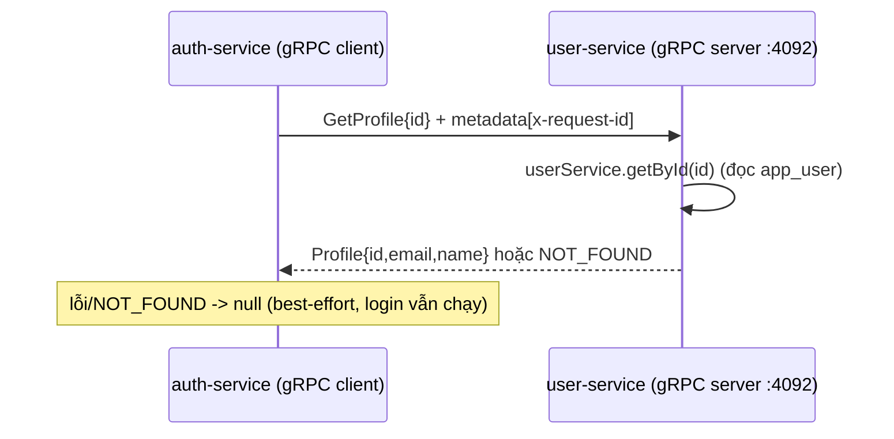

# Phần 6.3 — Giao tiếp giữa service: REST + correlation-id & demo gRPC

> Ở 6.2 cuộc gọi `auth → user` còn "trần trụi". Commit này (1) truyền **correlation-id**
> xuyên service, và (2) thêm **gRPC** cho luồng đọc profile để so sánh với REST.

---

## 6.3.1 — Correlation-id không cần luồn `req` khắp nơi

Vấn đề: `user-client` nằm sâu trong service, không cầm `req` để biết `req.id`. Luồn `req` qua
mọi hàm (controller → service → client) thì bẩn code kinh khủng.

Lời giải: **`AsyncLocalStorage`** (ALS) của Node — một "biến toàn cục theo request". Middleware
`requestId` bọc phần còn lại của request trong `requestContext.run({ requestId }, next)`. Sau đó
BẤT KỲ code nào trong cùng request gọi `getRequestId()` đều lấy đúng id — kể cả sau `await`.

```
requestId middleware ──run(store={requestId})──▶ controller ▶ service ▶ user-client.getRequestId() ✅
```

`user-client` (REST) và `user-grpc-client` (gRPC) đều đọc `getRequestId()` rồi gắn header
`x-request-id`. Kết quả: một lần đăng nhập tạo log ở **gateway → auth → user** với **cùng một id**
→ gộp lại dựng được toàn cảnh. Đây là nền cho distributed tracing (6.6).

## 6.3.2 — Vì sao thêm gRPC (mà không thay hết REST)?

| | REST/JSON | gRPC |
| --- | --- | --- |
| Hợp đồng | tự quy ước (Zod/OpenAPI) | **`.proto` cứng**, sinh code cho cả 2 bên |
| Dữ liệu trên dây | JSON (text) | nhị phân (protobuf) — nhỏ & nhanh hơn |
| Hợp cho | biên hệ thống, gọi từ trình duyệt | **gọi nội bộ dày đặc** giữa service |
| Debug bằng curl | dễ | khó (cần grpcurl) |

Chọn thực dụng của tutorial: **REST/JSON ở biên** (FE ↔ gateway ↔ service), **gRPC cho một luồng
nội bộ** (`auth → user` đọc profile) để bạn sờ tận tay. Ghi (create/delete profile) vẫn REST — cố ý
để bạn thấy **cả hai cùng tồn tại**.

## 6.3.3 — Hợp đồng `.proto` dùng chung

`packages/shared/proto/user.proto` định nghĩa `UserInternal.GetProfile`. Cả **server**
(user-service) lẫn **client** (auth-service) nạp cùng file này bằng `@grpc/proto-loader` lúc chạy
(không cần bước codegen). `@app/shared` chỉ export **đường dẫn** tới `.proto` (qua `import.meta.url`)
— lại một lần nữa monorepo giúp hai bên "nói cùng một hợp đồng".



## 6.3.4 — Điểm tinh tế

- **gRPC chạy SONG SONG với HTTP**: user-service mở cả `:4002` (HTTP) và `:4092` (gRPC). Ghi/đọc
  qua gateway vẫn REST; chỉ auth gọi nội bộ mới dùng gRPC.
- **Best-effort giữ nguyên**: `getProfile` gRPC lỗi → trả `null` → login vẫn thành công (name
  fallback). Triết lý *degrade gracefully* từ 6.2 không đổi, chỉ đổi phương tiện.
- **Correlation-id qua gRPC** đi bằng `Metadata` (tương đương header của HTTP).

## 6.3.5 — Thử

```bash
pnpm dev:all   # user-service in "🔌 gRPC lắng nghe :4092"
# đăng nhập -> auth-service gọi gRPC sang user-service lấy name
# xem log 2 service cùng một requestId
```

> Còn lại: cuộc gọi vẫn chưa có **timeout/retry/circuit breaker** (mạng lỗi kéo dài sẽ làm auth
> chờ lâu). Đó là **6.7**. Trước đó, **6.4** làm chặt luồng đăng ký thành **saga**.
