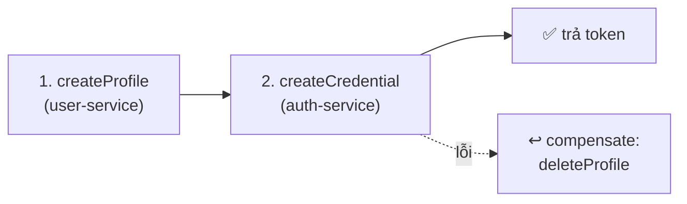

# Phần 6.4 — Database-per-service, Saga & Eventual Consistency

> Ở monolith, "tạo user" là **một transaction**: hoặc thành công cả, hoặc rollback cả. Khi dữ liệu
> nằm ở **hai DB của hai service**, không còn transaction chung. Commit này giải bài toán đó bằng **saga**.

---

## 6.4.1 — Vì sao mất transaction?

Đăng ký giờ ghi vào **2 nơi**: `users` (DB app_user) + `credentials` (DB app_auth). Không có
`BEGIN…COMMIT` bao trùm hai DB (lại còn qua mạng). Nếu bước 1 xong mà bước 2 lỗi → **dữ liệu rác**:
một profile không có credential (không đăng nhập được, "mồ côi").

Ta không thể có **nhất quán tức thời** (immediate consistency) nữa. Thứ đạt được là **eventual
consistency**: có thể "lệch" trong chốc lát, nhưng hệ thống **tự dọn** về trạng thái đúng.

## 6.4.2 — Saga = chuỗi bước + bù trừ (compensation)

Mẫu **saga orchestration**: làm tuần tự; mỗi bước thành công thì *ghi nhớ cách hoàn tác*; nếu bước
sau lỗi thì chạy hoàn tác **theo thứ tự ngược**.



`packages/shared/src/saga.ts` cung cấp lớp `Saga` nhỏ:

```ts
const saga = new Saga(logger, "register");
try {
  const profile = await userClient.createProfile(...);
  saga.onCompensate("createProfile", () => userClient.deleteProfile(profile.id));

  const cred = await credentialRepository.create({ userId: profile.id, ... });
  saga.onCompensate("createCredential", () => credentialRepository.deleteById(cred.userId));
  // ...
  return { user, accessToken, refreshToken };
} catch (err) {
  await saga.compensate();   // hoàn tác NGƯỢC thứ tự các bước đã xong
  throw err;
}
```

Mỗi bước mới chỉ cần thêm 1 dòng `onCompensate` — mở rộng dễ, không lồng try/catch chồng chất.

## 6.4.3 — Bù trừ là best-effort (và điều đó OK)

`saga.compensate()` chạy từng undo, **nuốt lỗi từng cái** (một undo hỏng không chặn cái khác) và
**ghi log** cái nào hỏng. Vì sao? Nếu ngay cả undo cũng lỗi (vd user-service vừa sập), ta không thể
làm gì hơn lúc đó — nhưng có log để **người vận hành hoặc job dọn dẹp** xử lý sau. Đó là bản chất
eventual consistency: không hoàn hảo tức thì, nhưng có đường về.

## 6.4.4 — Race condition & idempotency

Hai request đăng ký cùng email gần như đồng thời:

- Fast-path `findByEmail` có thể **cho qua cả hai** (chưa ai kịp ghi).
- **Chốt chặn thật** là `UNIQUE(email)` ở DB: `users.email` unique chặn profile trùng → user-service
  trả **409**; `user-client` dịch 409 → `Conflict` (không phải 503 "service chết"). Request thua cuộc
  nhận đúng **409**, và saga xoá phần đã lỡ tạo.
- **Welcome email** đã idempotent từ Phần 5 (jobId = `welcome-<userId>`): enqueue trùng cũng chỉ 1 job.

> Bài học: **đừng tin fast-path** để đảm bảo tính duy nhất — luôn có một **ràng buộc cứng** (unique
> ở DB) làm chốt chặn cuối, còn saga lo dọn dẹp phần dở dang.

## 6.4.5 — Thử

```bash
# Đăng ký email bình thường -> 2 bản ghi ở 2 DB, cùng userId.
# Mô phỏng lỗi bước 2: tắt Redis hoặc sửa tạm cho create credential ném lỗi
#   -> xem log "↩️ đã bù trừ bước createProfile" và profile bị xoá (không mồ côi).
```

> Tiếp theo **6.5**: nhiều `.env` rải rác + URL service hardcode → **service discovery & config
> tập trung**.
