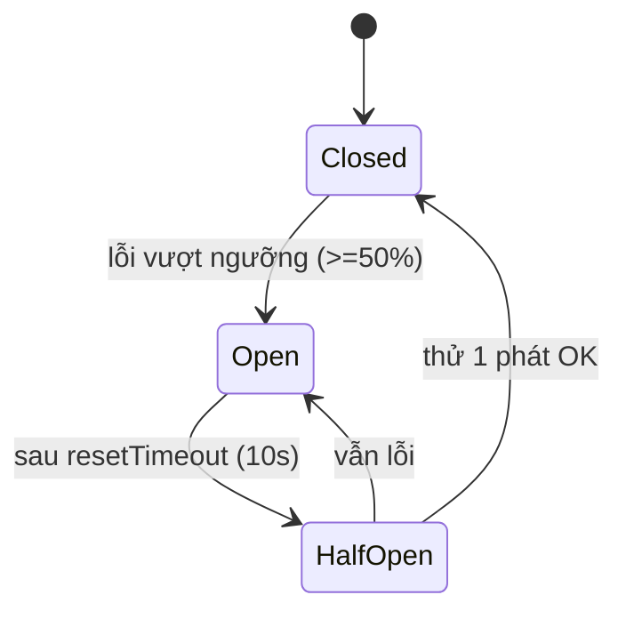

# Phần 6.7 — Xử lý lỗi phân tán: Timeout, Retry, Circuit Breaker

> Commit cuối của Phần 6. Trong hệ phân tán, **mạng sẽ lỗi** — không phải "nếu" mà là "khi nào".
> Ba mẫu dưới đây giữ cho một service chết KHÔNG kéo sập cả hệ thống.

---

## 6.7.1 — Vì sao gọi mạng cần "áo giáp"

Ở monolith, gọi hàm không bao giờ "treo 30 giây". Gọi mạng thì có: user-service chậm/chết khiến
auth-service **chờ**, giữ luồng, cạn tài nguyên, rồi request tới auth cũng chờ theo → **lỗi lan
dây chuyền** (cascading failure). Ba lớp phòng thủ:

| Mẫu | Chống điều gì |
| --- | --- |
| **Timeout** | chờ vô hạn một service chậm |
| **Retry (+backoff)** | lỗi chớp nhoáng (gói tin rớt, GC pause) |
| **Circuit breaker** | dội request vào service *đang chết* → cho nó thở, và fail nhanh |

## 6.7.2 — Timeout: luôn có hạn

- REST: `fetch(..., { signal: AbortSignal.timeout(3000) })` — quá 3s là huỷ, giải phóng luồng.
- gRPC: `options.deadline = Date.now() + 2000` — deadline truyền cả sang server.

> Quy tắc: **mọi** cuộc gọi mạng phải có timeout. "Không timeout" = "timeout vô hạn" = quả bom nổ chậm.

## 6.7.3 — Retry: chỉ khi AN TOÀN

`withRetry` (trong `@app/shared`) thử lại với **exponential backoff + jitter** (200ms, 400ms… cộng
ngẫu nhiên để tránh nhiều client retry đồng loạt — *thundering herd*).

Điểm mấu chốt — **đừng retry mù**:

- `createProfile`: retry lỗi *transient*, nhưng **KHÔNG** retry lỗi **409 (email trùng)** — retry
  cũng vẫn 409, chỉ tổ hại. `shouldRetry` loại 409 ra.
- `deleteProfile` (bù trừ): best-effort, chỉ cần timeout — không retry cho gọn.
- Chỉ retry thao tác **idempotent** hoặc lỗi chắc chắn transient, kẻo gây tác dụng phụ trùng.

## 6.7.4 — Circuit Breaker (opossum): cho service đang chết được thở

Ý tưởng như cầu dao điện:



- **Closed**: cho qua bình thường, đếm tỉ lệ lỗi.
- **Open**: user-service lỗi liên tục → mạch **mở** → mọi call **fail NGAY** (fallback), không dội
  vào service đang chết, không bắt user chờ timeout từng lần.
- **Half-Open**: sau 10s thử một phát; OK thì đóng lại, lỗi thì mở tiếp.

Trong code:

- `createProfile` (đăng ký — bắt buộc): mạch mở → `fallback` ném `ServiceUnavailable (503)` → client
  biết "thử lại sau", saga không tạo dữ liệu rác. `errorFilter` loại 409 khỏi việc tính "lỗi hệ thống".
- `getProfile` gRPC (đọc — best-effort): mạch mở → `fallback` trả **null** → **login vẫn chạy** (name
  fallback). Cùng một công cụ, hai chính sách khác nhau tuỳ mức quan trọng của cuộc gọi.

## 6.7.5 — Thử (thấy circuit breaker hoạt động)

```bash
pnpm dev:all
# Tắt user-service (Ctrl-C ở terminal của nó) rồi:
#  - LOGIN vẫn thành công (getProfile mở mạch -> null -> name fallback). 
#  - REGISTER trả 503 nhanh (createProfile mở mạch) thay vì treo 3s mỗi lần.
# Bật lại user-service, chờ ~10s -> mạch half-open -> tự phục hồi.
```

Ghép với **6.6**: mở Jaeger sẽ thấy span khi mạch mở **rất ngắn** (fail nhanh) thay vì kéo dài timeout.

---

## Kết Phần 6

Bạn đã đi từ **monolith** → **microservices** đủ bộ: tách theo domain, `packages/shared`, REST +
gRPC + correlation-id, saga/eventual consistency, service discovery, distributed tracing, và
resilience. Bước tiếp theo của tutorial là **Phần 7 — API Gateway thật** (thay `apps/api` tạm):
routing, verify JWT tập trung, rate limit, aggregation, BFF.
