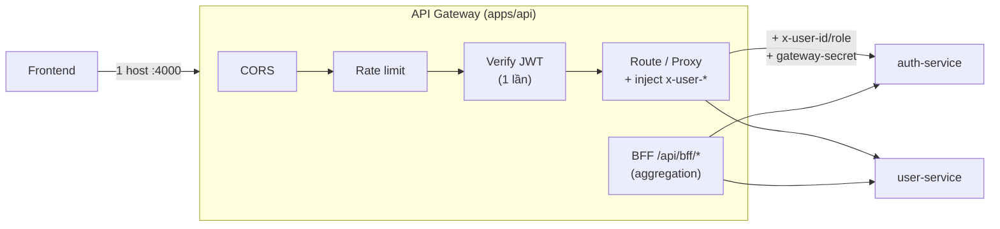

# Phần 7.1 — Vai trò của API Gateway

> Ở Phần 6, `apps/api` mới là **gateway-lite** (chỉ proxy). Phần 7 nâng nó thành **API Gateway thật**:
> một cửa vào (single entry point) lo những việc *ngang* (cross-cutting) cho mọi service.

---

## 7.1.1 — Vì sao cần một cửa vào chung?

Không có gateway, frontend phải biết địa chỉ từng service, tự xử CORS nhiều origin, mỗi service tự
verify JWT, tự rate-limit… → **lặp lại khắp nơi** và lộ topology nội bộ ra ngoài.

Gateway gom các mối quan tâm *ngang* về **một chỗ**:

| Việc | Vì sao nên ở gateway |
| --- | --- |
| **Routing** | FE gọi 1 host; gateway biết `/api/auth`→auth, `/api/users`→user |
| **Auth tập trung** | verify JWT **một lần**, truyền danh tính xuống service (7.3) |
| **Rate limit** | chặn brute-force/abuse ở biên, trước khi chạm service (7.4) |
| **CORS** | cấu hình **một nơi**, service nội bộ khỏi lo (7.4) |
| **Aggregation / BFF** | gộp nhiều service thành 1 response hợp với FE (7.5) |
| **Che giấu nội bộ** | client không biết có bao nhiêu service, ở port nào |

## 7.1.2 — Kiến trúc đích của Phần 7

Điểm mấu chốt (làm ở các commit sau):

- **Verify JWT một lần tại gateway** (7.3): service *tin* header `x-user-*` do gateway gắn, **không
  verify lại** → bớt lặp, service gọn hơn. Kèm "bằng chứng" (gateway-secret) để service biết header
  đến từ gateway thật, không phải kẻ giả mạo.
- **CORS + rate limit** dồn về gateway (7.4): service nội bộ không cần biết tới trình duyệt.
- **BFF** (7.5): gateway tự gọi nhiều service rồi trả một payload gọn cho FE.

## 7.1.3 — Ranh giới: gateway KHÔNG làm gì

Để gateway không phình thành "monolith trá hình":

- **Không chứa business logic** — chỉ điều phối. Luật nghiệp vụ vẫn ở service.
- **Không chạm DB của service** — muốn dữ liệu thì gọi API service (kể cả BFF).
- **Không giữ trạng thái** — stateless để scale ngang dễ (rate-limit dùng Redis dùng chung).

## 7.1.4 — Lộ trình Phần 7

| Commit | Nội dung |
| --- | --- |
| **7.2** | Tự viết (Express) vs Kong/Traefik/Nginx/KrakenD — chọn cái nào khi nào (+ config tham khảo) |
| **7.3** | Verify JWT tại gateway + truyền context xuống service (trust headers + gateway-secret) |
| **7.4** | CORS tập trung, rate limiting (Redis), hardening header |
| **7.5** | BFF pattern — gộp nhiều service thành một endpoint cho FE |

> Ta **tiếp tục tự viết bằng Express** (để hiểu bản chất), nhưng 7.2 sẽ chỉ rõ khi nào nên chuyển
> sang gateway "đóng hộp" (Kong/Traefik/KrakenD) và vì sao.
