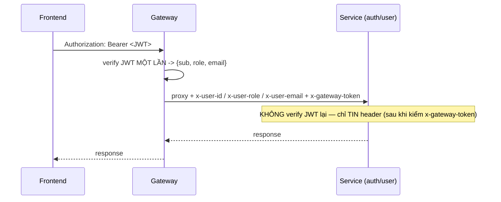

# Phần 7.3 — Verify JWT tại Gateway & truyền context xuống service

> Ở Phần 6, **mỗi service tự verify JWT** (lặp lại, mỗi service cần JWT secret). Giờ gateway verify
> **một lần**, rồi truyền danh tính xuống service qua header tin cậy.

---

## 7.3.1 — "Verify once at the edge"



Lợi ích: service gọn hơn (không cần JWT secret, không lặp code verify), đổi thuật toán token chỉ
sửa ở gateway. Đây là mô hình chuẩn của API gateway.

## 7.3.2 — Mối nguy: header có thể bị GIẢ MẠO

Nếu service **tin mù** `x-user-role: ADMIN`, thì ai gọi thẳng service (bỏ qua gateway) với header đó
là thành admin! Hai lớp chặn:

1. **Gateway xoá sạch** `x-user-*` và `x-gateway-token` từ client ở đầu vào (`stripSpoofedHeaders`)
   → client không thể "tiêm" sẵn.
2. **Bằng chứng đến từ gateway**: gateway gắn `x-gateway-token = GATEWAY_SECRET` (secret chung). Service
   chỉ tin `x-user-*` **sau khi** `x-gateway-token` khớp secret (`trustGatewayUser`). Kẻ gọi thẳng
   service không biết secret → bị từ chối 401.

> Ở production còn nên **cô lập mạng** (service không mở ra internet, chỉ gateway public) và/hoặc
> **mTLS**. Shared-secret ở đây là defense-in-depth dễ hiểu để bắt đầu.

## 7.3.3 — Pipeline gateway (apps/api)

```
helmet → cors → requestId → log
      → stripSpoofedHeaders     (xoá x-user-*/x-gateway-token từ client)
      → attachUser              (có Bearer? verify -> req.user; không thì bỏ qua)
      → requireAuth cho /api/users và /api/auth/me
      → proxy (+ inject x-user-* + x-gateway-token xuống service)
```

- **Route công khai** (`/login`, `/register`, `/refresh`, `/logout`, `/oauth/*`): không cần token —
  attachUser bỏ qua, proxy vẫn gắn `x-gateway-token` (bằng chứng origin) nhưng không có `x-user-*`.
- **Route cần đăng nhập** (`/api/users`, `/api/auth/me`): `requireAuth` chặn nếu chưa verify được.

## 7.3.4 — Service phía sau đổi gì

- `user-service`: bỏ `createAuthenticate(JWT_ACCESS_SECRET)` → dùng `trustGatewayUser(GATEWAY_SECRET)`;
  vẫn `authorize("ADMIN")` từ `role` trong context. **Không còn cần `JWT_ACCESS_SECRET`.**
- `auth-service` `/me`: tương tự, tin context gateway. (auth vẫn giữ JWT secret để *ký* token.)
- Endpoint nội bộ `/api/internal/users` (auth→user, không qua gateway) **không** đổi — vẫn là mạng
  tin cậy giữa service.

## 7.3.5 — Cấu hình

`GATEWAY_SECRET` phải **giống nhau** ở gateway + auth-service + user-service (xem các `.env.example`).
`JWT_ACCESS_SECRET` giờ chỉ cần ở **gateway** (verify) và **auth-service** (ký) — user-service không cần nữa.

## 7.3.6 — Thử

```bash
pnpm dev:all
B=http://localhost:4000
ADMIN=$(curl -s -X POST $B/api/auth/login -H 'Content-Type: application/json' \
  -d '{"email":"admin@example.com","password":"password123"}' | jq -r .accessToken)

curl -s $B/api/users -H "Authorization: Bearer $ADMIN"      # OK (gateway verify -> ADMIN)
curl -s $B/api/users                                         # 401 (gateway chặn, chưa đăng nhập)

# Chứng minh chống giả mạo: gọi THẲNG user-service với header bịa -> bị từ chối
curl -s http://localhost:4002/api/users -H 'x-user-id: hacker' -H 'x-user-role: ADMIN'
#   -> 401 "Yêu cầu phải đi qua API gateway" (thiếu x-gateway-token đúng)
```

> Tiếp theo **7.4**: dồn **CORS** về gateway + thêm **rate limiting** (chặn brute-force login).
