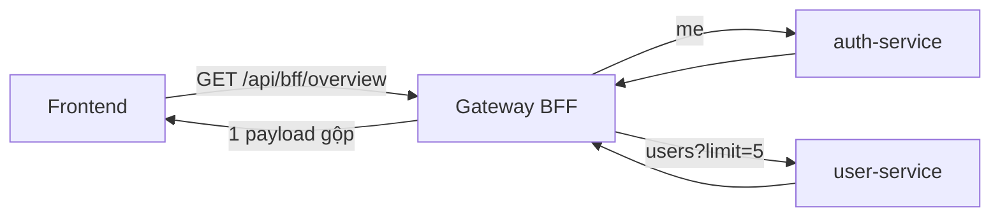

# Phần 7.5 — BFF (Backend-for-Frontend)

> Commit cuối Phần 7. Gateway không chỉ *chuyển tiếp* — nó có thể **gộp** nhiều service thành một
> response "may đo" cho frontend.

---

## 7.5.1 — Vấn đề: FE phải tự ghép nhiều API

Trang dashboard cần: hồ sơ của tôi (auth-service) + thống kê user (user-service). Không có BFF, FE
phải:

```
FE → GET /api/auth/me        (round-trip 1)
FE → GET /api/users?limit=5  (round-trip 2)
FE tự ghép, tự xử lý lỗi từng cái, tự biết gọi service nào...
```

Nhiều round-trip (chậm trên mạng di động), FE dính chặt vào topology backend, và lộ chi tiết nội bộ.

## 7.5.2 — BFF: một endpoint "may đo" cho FE

Gateway tự fan-out rồi gom lại:



`GET /api/bff/overview` (xem `apps/api/src/bff/bff.routes.ts`) trả:

```jsonc
{
  "me":    { "id": "...", "email": "...", "name": "...", "role": "ADMIN" },
  "admin": { "totalUsers": 42, "recentUsers": [ /* 5 user gần nhất */ ] }  // null nếu không phải ADMIN
}
```

Điểm hay:

- **Fan-out song song** (`Promise.all`) → tổng thời gian ≈ call chậm nhất, không cộng dồn.
- **Định hình theo FE**: trả đúng thứ trang cần, gộp/đổi tên field tuỳ ý — FE nhận gọn.
- **Tận dụng 7.3**: BFF gọi service với **cùng** cơ chế header tin cậy (`x-gateway-token` + `x-user-*`)
  → service không phân biệt "proxy" hay "BFF", đều xác thực như nhau.
- **Best-effort**: một service lỗi → phần đó `null`, phần còn lại vẫn trả (không sập cả trang).

## 7.5.3 — BFF khác Aggregation Gateway thế nào?

- **Aggregation** (gộp API) là *kỹ thuật*.
- **BFF** là *mẫu tổ chức*: mỗi loại client (web, mobile, TV…) có **một BFF riêng**, may đo cho đúng
  nhu cầu client đó — thay vì một API "một cỡ cho tất cả". Ở đây ta có một BFF cho web; nếu làm app
  mobile, có thể thêm `apps/bff-mobile` trả payload khác.

## 7.5.4 — Ranh giới: BFF KHÔNG phải nơi nhét business logic

BFF chỉ **điều phối + định hình**: gọi service, gộp, đổi hình dạng. **Luật nghiệp vụ vẫn ở service**
(tính tổng, phân quyền chi tiết…). Nếu thấy BFF bắt đầu chứa "if nghiệp vụ", đó là mùi code sai chỗ.

## 7.5.5 — Thử

```bash
B=http://localhost:4000
ADMIN=$(curl -s -X POST $B/api/auth/login -H 'Content-Type: application/json' \
  -d '{"email":"admin@example.com","password":"password123"}' | jq -r .accessToken)

curl -s $B/api/bff/overview -H "Authorization: Bearer $ADMIN" | jq
#  -> { me: {...}, admin: { totalUsers, recentUsers: [...] } }  — 1 call, 2 service.
```

> **Kết Phần 7.** `apps/api` giờ là API Gateway thật: routing, verify JWT tập trung + truyền context,
> CORS/rate-limit/transform ở biên, và BFF aggregation. Bước tiếp của tutorial là **Phần 8 — đóng gói
> Docker** cho toàn hệ thống.
